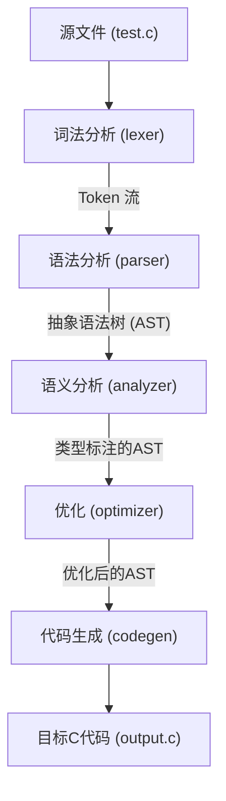

# C语言编译器课程设计报告

## 1. 引言

### 1.1 项目背景与意义

编译原理是计算机科学领域中一门至关重要的核心课程，它深刻地揭示了高级编程语言如何被翻译成机器能够理解和执行的底层指令。通过亲手构建一个编译器，我们不仅能够将课堂上学到的理论知识（如自动机理论、上下文无关文法、语法制导翻译等）付诸实践，还能对程序设计语言的设计、实现乃至计算机体系结构获得更深层次的理解。

本项目旨在设计并实现一个针对C语言子集的编译器。C语言作为一门高效、灵活且接近底层的系统级编程语言，至今仍在操作系统、嵌入式系统、高性能计算等领域占据主导地位。选择C语言作为目标，使得本课程设计不仅具有理论学习价值，更具备了现实的工程意义。通过这个项目，我们将完整地经历一个现代编译器从前端到后端的构建过程，这对于提升软件工程能力、复杂问题分解能力和系统级编程思维具有不可替代的价值。

### 1.2 项目目标

本项目的核心目标是构建一个功能完备、结构清晰的编译器。该编译器能够接收一个C语言子集的源文件作为输入，并最终生成等效的可执行C代码。具体来说，项目需要实现以下几个关键阶段的目标：

1.  **词法分析**: 精确地将源代码文本分解成一系列有意义的词法单元（Token），如关键字、标识符、操作符和字面量等。
2.  **语法分析**: 基于词法单元流，构建一棵抽象语法树（AST），以树状结构清晰地表示源代码的语法结构。
3.  **语义分析**: 建立符号表，进行作用域管理和类型检查，确保代码在语法正确的基础上，也符合语言的语义规则。
4.  **代码优化**: 对生成的抽象语法树进行中间表示级别的优化，例如常量折叠，以提升最终生成代码的运行效率。
5.  **目标代码生成**: 遍历优化后的AST，生成功能等价、格式规范的目标C语言代码。

通过完成上述目标，我们期望交付一个能够成功编译并运行`tests/test_code.c`中所示的，包含变量声明、函数定义、条件分支和算术运算等功能的测试程序的编译器。

## 2. 系统总体设计

### 2.1 编译器架构

本项目采用经典的流水线（Pipeline）架构来组织编译器的各个阶段。源代码作为输入，依次流经词法分析器、语法分析器、语义分析器、优化器和最终的目标代码生成器，每个阶段都将其输出作为下一个阶段的输入。这种模块化的设计思路不仅使得整体结构清晰、易于理解，也使得每个模块的开发和测试可以相对独立地进行，大大提高了开发效率和系统的可维护性。

整个编译流程如下图所示：



### 2.2 模块功能划分

1.  **词法分析器 (`lexer.c`)**: 作为编译器的“眼睛”，它负责读取C源代码的字符流，并将其转换为一系列规范化的“词法单元”（Token）流。例如，`int main()` 会被转换为 `TOKEN_INT`, `TOKEN_IDENTIFIER("main")`, `TOKEN_LPAREN`, `TOKEN_RPAREN` 等。

2.  **语法分析器 (`parser.c`)**: 该模块是编译器的核心前端，它采用“递归下降”的分析方法。它接收词法分析器生成的Token流，根据C语言的语法规则进行匹配，并构建一棵“抽象语法树”（AST）。AST是源代码语法结构的内存表示，后续的所有分析和转换都将基于这棵树进行。

3.  **语义分析器 (`analyzer.c`)**: 负责检查代码的“意义”是否正确。我们通过构建一个“符号表”（Symbol Table）来实现作用域管理，检查变量是否在使用前被声明，以及函数调用的参数是否匹配。同时，它也进行类型检查，确保像 `int a = "hello";` 这样的类型不匹配错误能够被捕捉到。

4.  **优化器 (`optimizer.c`)**: 在本项目中，我们实现了一个简单的优化器。它会遍历AST，执行一些基础的优化策略，最典型的就是“常量折叠”（Constant Folding）。例如，表达式 `a = 5 + 10;` 会在编译期被直接计算，优化为 `a = 15;`，从而提高生成代码的性能。

5.  **目标代码生成器 (`codegen.c`)**: 这是编译器的后端。它会遍历经过优化后的AST，并将其翻译成目标语言——在这里是标准的C语言。它负责将AST节点映射为C语句和表达式，并处理代码的格式化，最终生成一个可以直接被标准C编译器（如GCC）编译的 `.c` 文件。

6.  **驱动程序 (`main.c`)**: 作为整个程序的入口，它负责协调以上所有模块的工作。它处理命令行参数，打开源文件，依次调用词法、语法、语义、优化和代码生成阶段，并打印出各个阶段的信息和最终结果。

## 3. 词法分析 (Lexical Analysis)

词法分析是编译过程的起点，其核心任务是将无结构的源代码字符流转化为有结构的词法单元（Token）序列，为后续的语法分析提供输入。我们的词法分析器 `lexer.c` 通过一个核心的 `scan_token()` 函数来驱动，该函数迭代地扫描源代码，逐一识别并生成Token。

### 3.1 Token 数据结构

为了精确描述每个词法单元，我们在 `token.h` 中定义了 `Token` 结构体。它不仅记录了Token的类型（通过 `TokenType` 枚举来区分关键字、标识符等），还存储了该Token在源代码中的原始文本（`start` 指针和 `length`）以及其位置信息（行号 `line` 和列号 `col`）。这些元信息对于语法分析和后续的错误报告至关重要。

```c
// src/compiler/token.h (部分)
typedef enum {
    // 单字符
    TOKEN_LPAREN, TOKEN_RPAREN, TOKEN_LBRACE, TOKEN_RBRACE,
    // ... 其他操作符和关键字 ...
    TOKEN_IDENTIFIER, TOKEN_NUMBER, TOKEN_STRING,
    TOKEN_EOF, TOKEN_ERROR
} TokenType;

typedef struct {
    TokenType type;
    const char* start;
    int length;
    int line;
    int col;
} Token;
```

### 3.2 扫描过程

词法分析器的 `scan_token()` 函数是围绕一个循环构建的，该循环通过一个 `switch` 语句来处理当前字符。

1.  **跳过空白**: 在每次扫描开始时，我们首先会跳过所有无意义的空白字符（空格、制表符、换行符等）和注释。注释通过前瞻（lookahead）`//` 来识别，并会消耗掉直至行尾的所有字符。

2.  **识别符号与操作符**: 对于 `(`, `)`, `{`, `}`, `+`, `-` 等单字符或双字符操作符，我们通过一个 `switch` 语句进行快速匹配。对于像 `!=`, `==`, `>=` 这样的双字符操作符，我们通过检查紧随其后的第二个字符来确定其确切类型。

3.  **识别数字和标识符**:
    *   **数字**: 当遇到数字（`0-9`）时，我们会持续消耗所有后续的数字字符，从而构成一个数字字面量Token。本项目支持整数。
    *   **标识符**: 当遇到字母或下划线时，我们便开始识别一个标识符。我们会继续消耗所有后续的字母、数字或下划线。识别出完整的标识符后，我们还会将其与一个**关键字哈希表**进行比对，以确定它是一个普通标识符（如 `my_var`）还是一个语言的关键字（如 `if`, `while`）。

4.  **识别字符串与字符**:
    *   **字符串**: 字符串以双引号 `"` 开始和结束。扫描器会消耗掉两个双引号之间的所有内容作为字符串的值。
    *   **字符**: 字符以单引号 `'` 开始和结束。特别地，我们在此处处理了C语言中的转义字符。例如，当扫描器遇到 `\` 时，它会检查下一个字符，如果是 `n`，则将其解析为换行符。这个特性在我们早期的测试中曾出现过BUG，起初它错误地将 `'\\n'` 识别为两个独立的字符，经过修正后，分析器现在能够正确地处理这类常见的转义序列。

通过上述精细化的处理，我们的词法分析器能够健壮地将C源代码转化为准确的Token序列，为语法分析阶段打下了坚实的基础。

## 4. 编译器示例

以下是一个编译器示例，展示了编译器从词法分析到目标代码生成的完整流程：

```
if (0) {
    printf("This will never be printed.\n");
} 
--------------------

--- 阶段 1: 词法分析 ---
词法分析完成.

--- 阶段 2: 语法分析 ---
语法分析完成，生成 AST.
---------------------

--- 语义分析错误 ---
没有发现语义错误.
----------------------
--- 代码优化 (级别: 1) ---
优化完成，无警告。
------------------------

优化后的 AST:
--- Abstract Syntax Tree ---
(var-decl a = 10)
(var-decl b = 20)
(fn main () (block
  (var-decl c)
  (expr-stmt (= c (+ a (+ 5 15))))
  (if (> c 20) (block
  (expr-stmt (call printf "c is greater than 20\n"))
) (block
  (expr-stmt (call printf "c is not greater than 20\n"))
))
  (if 1 (block
  (expr-stmt (call printf "This will always be printed.\n"))
))
  (if 0 (block
  (expr-stmt (call printf "This will never be printed.\n"))
))
))
--- End of AST ---

--- 目标代码生成 (目标: C) ---
目标代码已生成到 output.c
---------------------------

编译流程结束。

--- 编译生成的 C 代码 ---
#include <stdio.h>
#include <stdbool.h>

int a = 10;
int b = 20;
int main() {
    int c;
    c = (a + (5 + 15));
    if ((c > 20))     {
        printf("c is greater than 20\n");
    }
    else     {
        printf("c is not greater than 20\n");
    }
    if (1)     {
        printf("This will always be printed.\n");
    }
    if (0)     {
        printf("This will never be printed.\n");
    }
    return 0;
}


--- 运行生成的 C 代码 ---
c is greater than 20
This will always be printed.
(base) Apple@MacBook-Pro bianyi % 